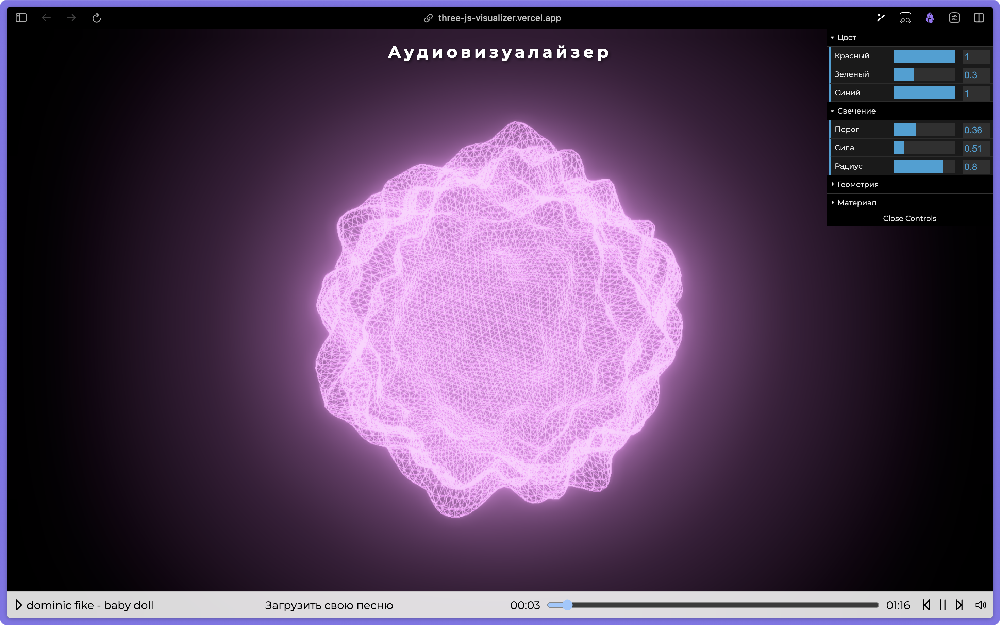

<h1>3D аудио визуализатор</h1>

## Описание

3D визуализация музыки используя Three.js и web audio API

[Try it here](https://three-js-visualizer.vercel.app/)

### Главный экран



### Технологии

- **Основное:** TS, Vue.js, Pinia
- **Сборка:** Vite, Yarn
- **UI:** PrimeVue, PrimeFlex, PrimeIcons
- **3D & Аудио:** THREE.js, Web Audio API
- **Кодстайл:** ESLint, Prettier

## Установка

1. Склонируйте репозиторий:

   ```bash
   git clone https://github.com/nikgritenok/three-js-visualizer.git
   ```

2. Установите зависимости:

   ```bash
   yarn install
   ```

3. Запустите приложение:

   ```bash
   yarn dev
   ```

4. Откройте приложение в браузере по адресу [http://localhost:5173](http://localhost:5173).
